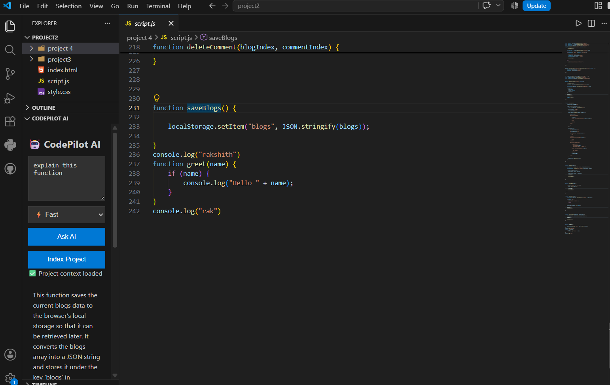
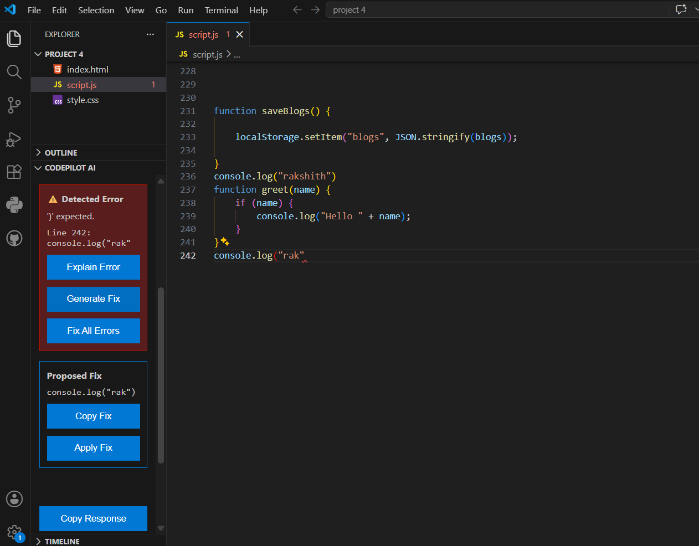

CodePilot AI

CodePilot AI is a VS Code extension that brings a local AI coding assistant directly into the editor.

It can explain code, detect errors from VS Code diagnostics, generate fixes, answer questions about the current project, and use RAG to understand files across the workspace. The current version runs with local Ollama models, so no paid API is required.

Features

CodePilot AI currently includes:

Ask AI directly from the Explorer sidebar

Fast, Normal, and Detailed response modes

Current-file and cursor-aware answers

Function-level context using VS Code document symbols

Short conversation memory for follow-up questions

Project-wide RAG search using LangChain

Automatic project indexing on startup

Incremental re-indexing when files are saved

Source attribution for project-aware answers

Clickable source files that open directly in VS Code

Automatic VS Code error detection

Screenshots

Project-Aware AI Chat

CodePilot can answer questions using the current project context and show the relevant source files.

Error Detection and AI Fixes

CodePilot detects VS Code diagnostics, generates a proposed fix, and lets the user review it before applying changes.

Explain Error

Generate Fix with preview

Apply Fix with safety checks

Fix All Errors with a separate preview before applying changes

Explain Selected Code

Fix Selected Code

Improve Code

Copy Response and Copy Fix actions

Example workflow

If VS Code detects an error, CodePilot can show it inside the sidebar:

Detected Error
    ↓
Generate Fix
    ↓
Review Proposed Fix
    ↓
Apply Fix

For multiple related errors:

Fix All Errors
    ↓
Review Proposed Fix All
    ↓
Apply All Fixes

This keeps code changes visible before they are applied.

Project-Aware AI

CodePilot can index the current workspace and retrieve relevant code before answering a question.

For example:

button logic kis file me hai?

CodePilot can search the indexed project, identify the most relevant files, answer the question, and show the source files underneath the response.

The RAG pipeline currently uses:

LangChain

RecursiveCharacterTextSplitter

OllamaEmbeddings

nomic-embed-text

in-memory vector stores

Requirements

Before running CodePilot AI, install:

Visual Studio Code

Node.js

npm

Ollama

The current setup uses these Ollama models:

ollama pull qwen3:4b
ollama pull nomic-embed-text

Ollama should be running locally before starting the extension.

The extension connects to:

http://localhost:11434

Running the Extension

Install the project dependencies:

npm install

Compile the extension:

npm run compile

Open the project in VS Code and press:

F5

A new Extension Development Host window will open.

Open the Explorer sidebar and expand:

CodePilot AI

Using CodePilot AI

Ask about the current function

Place the cursor inside a function and ask:

What does this function do?

CodePilot uses the current file, cursor position, and detected function as context.

You can then ask a follow-up such as:

Can you optimize it?

The recent conversation is kept in memory during the current extension session.

Ask about the project

Ask a project-level question such as:

Which file contains the button click logic?

If the project has been indexed, CodePilot retrieves relevant chunks and shows the source files used for the answer.

Fix a detected error

When VS Code reports an error:

Open CodePilot AI.

Review the detected error.

Click Generate Fix.

Review the proposed code.

Click Apply Fix only if the preview looks correct.

Fix multiple errors

When a file contains several related diagnostics:

Click Fix All Errors.

CodePilot creates a combined correction preview.

Review Proposed Fix All.

Click Apply All Fixes to apply the preview.

The extension does not automatically apply the Fix All result without showing the proposed code first.

Quick Actions

Select code in the editor and use:

Explain Selected Code

Fix Selected Code

Improve Code

These actions send the selected code directly to the local model.

How It Works

The main flow is:

VS Code
   │
   ├── Diagnostics API
   │      └── Error detection and fix workflow
   │
   ├── Active Editor
   │      └── Current file / cursor / function context
   │
   ├── CodePilot Sidebar
   │      └── Questions, actions, previews and sources
   │
   └── RAG Service
          ├── Workspace files
          ├── Text chunking
          ├── Local embeddings
          └── Similarity search
                   │
                   ▼
             Ollama / Qwen3

Tech Stack

TypeScript

VS Code Extension API

Ollama

Qwen3

LangChain

nomic-embed-text

MemoryVectorStore

RecursiveCharacterTextSplitter

esbuild

Current Limitations

CodePilot AI is still under active development.

Current limitations include:

RAG data is stored in memory and is rebuilt after the extension restarts.

Conversation history is session-based.

Very large repositories may take longer to index.

AI-generated fixes can still be incorrect, so previews should always be reviewed.

Function detection depends on VS Code language support and document symbol providers.

Fix All is designed around the active file, not multi-file refactoring.

Planned Improvements

Future versions may include:

Persistent vector storage

Git-aware context

Inline editor suggestions

Diff-based fix previews

Test generation

Terminal and runtime error awareness

Multi-file refactoring

Configurable local models

Extension settings for model and indexing preferences

Persistent project conversations

Release Notes

1.0.0

Initial development release of CodePilot AI.

Included:

Local Ollama integration

AI chat sidebar

current-file and function-aware context

project RAG

automatic and incremental indexing

source navigation

error detection

Generate Fix

Apply Fix

Fix All preview workflow

selected-code quick actions

conversation memory

loading states and response modes

Privacy

The current version is designed around local inference.

Code and project context are sent to the locally running Ollama server configured at:

http://localhost:11434

The current implementation does not require a paid cloud AI API.

Notes

CodePilot AI is being built as a practical developer tool and as a project for exploring how VS Code extensions, local LLMs, RAG, diagnostics, and safe code editing can work together in one product.

AI-generated code should always be reviewed before applying it to important projects.